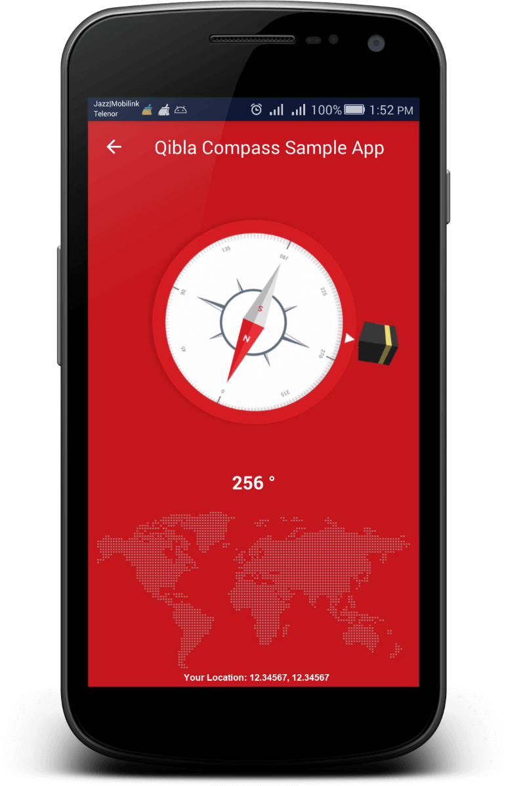

# hjQiblaCompass

An open source Android (Java) Native Library to incorporate/start Android Qibla Direction Activity in your Native Android Applcation.


## Configurations
### Dependency
```markdown
implementation 'com.hassanjamil:qibla:0.2.2'
```
### Root Level build.gradle
``` groovy
allprojects {
    repositories {
        jcenter()
        mavenCentral()
        google()
        maven { url "http://api.tplmaps.com:8081/artifactory/example-repo-local/" }
    }
}
```
### AndroidManifest.xml
``` xml
<activity
	android:name="com.hassanjamil.hqibla.CompassActivity"
	android:label="@string/app_name"
	android:screenOrientation="portrait"/>
```
### Sample Code
``` java
Intent intent = new Intent(MainActivity.this, CompassActivity.class);
intent.putExtra(Constants.TOOLBAR_TITLE, "My App");		// Toolbar Title
intent.putExtra(Constants.TOOLBAR_BG_COLOR, "#FFFFFF");		// Toolbar Background color
intent.putExtra(Constants.TOOLBAR_TITLE_COLOR, "#000000");	// Toolbar Title color
intent.putExtra(Constants.COMPASS_BG_COLOR, "#FFFFFF");		// Compass background color
intent.putExtra(Constants.ANGLE_TEXT_COLOR, "#000000");		// Angle Text color
intent.putExtra(Constants.DRAWABLE_DIAL, R.drawable.dial);	// Your dial drawable resource
intent.putExtra(Constants.DRAWABLE_QIBLA, R.drawable.qibla); 	// Your qibla indicator drawable resource
intent.putExtra(Constants.FOOTER_IMAGE_VISIBLE, View.VISIBLE|View.INVISIBLE|View.GONE);	// Footer World Image visibility
intent.putExtra(Constants.LOCATION_TEXT_VISIBLE, View.VISIBLE|View.INVISIBLE|View.GONE); // Location Text visibility
startActivity(intent);
```
### Screenshot
<p float="left">
 
</p>

### Contributor
Muhammad Hassan Jamil</br>
Team Lead Android Development</br>
hassanjamil91@gmail.com

Please contirbute to help in improvin' it.
