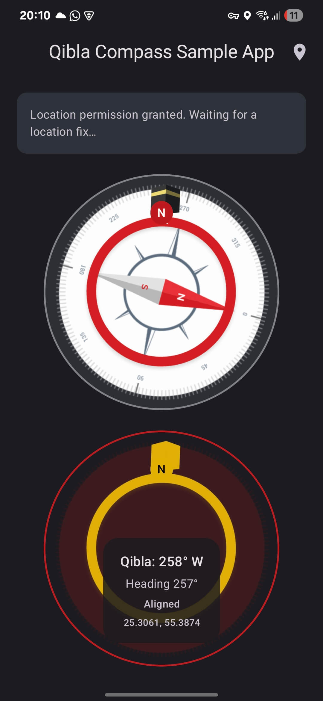

# hjQiblaCompass

An open source Android (Java) Native Library to incorporate/start Android Qibla Direction Activity in your Native Android Applcation.

> Note: The library is currently in progress of being rewritten completely including configurations.

### Screenshot

 

### Contributor
Muhammad Hassan Jamil 
Mobile Application Developer 
hassanjamil91@gmail.com

Please contirbute to help in improvin' it.
